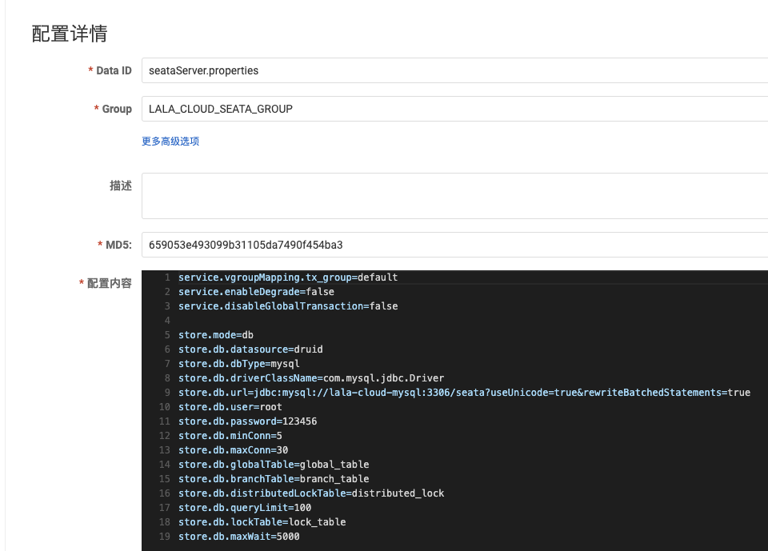

<!-- markdownlint-disable -->
<p align="center">
  
</p>
<h1 align="center">jerry-up · lala · lala-cloud-tool</h1>
<h4 align="center">基于docker快速搭建lala-cloud依赖环境</h4>
<p align="center">
    <a href="https://github.com/docker/compose" target="_blank">
        
    </a>
    <a href="./LICENSE" target="_blank">
        
    </a>
</p>

## 1. 前置环境

1. [docker-componse](https://www.runoob.com/docker/docker-compose.html)

## 2. 目录说明

```sh
lala-cloud-tool
  ├─mysql # 数据库配置
  │   ├─my.ini # 配置文件
  │   ├─nacos.sql # 初始化nacos数据库脚本
  │   └─seata.sql # 初始化seata数据库脚本
  ├─rocketmq-broker # 消息队列配置
  │   └─broker.conf # broker配置
	├─docker-compose.yml # docker-compose配置
	└─tool.env # 环境配置
```

## 3. 中间件列表

| 中间件                                  | 版本                                                         | 默认端口       | 默认用户名/密码   |
| ------------------------------------------- | ------------------------------------------------------------ | -------------- | ----------------- |
| [MySQL](https://www.mysql.com/)             | [5.7.36](https://dev.mysql.com/doc/relnotes/mysql/5.7/en/news-5-7-36.html) | 3306           | root/123456       |
| [Redis](https://redis.io)                   | [6.2.13](https://github.com/redis/redis/releases/tag/6.2.13) | 6379           | 123456            |
| [Nacos](https://nacos.io/zh-cn/)            | [2.2.0](https://github.com/alibaba/nacos/releases/tag/2.2.0) | 8848,9848,9849 | nacos/nacos       |
| [Seata](https://seata.io/zh-cn/)            | [1.6.1](https://github.com/seata/seata/releases/tag/v1.6.1) | 7091,8091      |                   |
| [Sentinel](https://sentinelguard.io/zh-cn/) | [1.8.6](https://sentinelguard.io/zh-cn/blog/sentinel-1-8-6-release.html) | 8080           | sentinel/sentinel |
| [RocketMQ](https://rocketmq.apache.org/zh/) | [5.0.0](https://github.com/apache/rocketmq/releases/tag/rocketmq-all-5.0.0) | 9876,10911,19876 | admin/123456 |

> 考虑国外拉取镜像过慢，镜像已传递至个人阿里云容器镜像服务，并设置仓库类型为公开。

| 中间件             | 阿里云容器镜像名                                             | Docker中央仓库镜像名                    |
| ------------------ | ------------------------------------------------------------ | --------------------------------------- |
| MySQL              | registry.cn-hangzhou.aliyuncs.com/jerry-up/mysql:5.7.36      | mysql:5.7.36                            |
| Redis              | registry.cn-hangzhou.aliyuncs.com/jerry-up/redis:6.2.13      | redis:6.2.13                            |
| Nacos              | registry.cn-hangzhou.aliyuncs.com/jerry-up/nacos-server:v2.2.0 | nacos/nacos-server:v2.2.0             |
| Seata              | registry.cn-hangzhou.aliyuncs.com/jerry-up/seata-server:1.6.1 | seataio/seata-server:1.6.1             |
| RocketMQ           | registry.cn-hangzhou.aliyuncs.com/jerry-up/rocketmq:5.0.0    | apache/rocketmq:5.0.0                   |
| RocketMQ-DashBoard | registry.cn-hangzhou.aliyuncs.com/jerry-up/rocketmq-dashboard:1.0.0 | apacherocketmq/rocketmq-dashboard:1.0.0 |

## 4. 部署

### 4.1. 修改配置文件

> **修改`tool.env`配置文件指定挂载目录以及中间件配置。**

| 配置项                          | 说明                | 默认值             |
| -------------------------------| -------------------|-------------------|
| VOLUMES_PATH                   | 挂载目录            |       .            |
| CONTAINER_PREFIX               | 容器名前缀          |  lala-cloud |
| MYSQL_PORT                     | mysql端口          |       3306          |
| MYSQL_PASSWORD                 | mysql密码          |         123456        |
| REDIS_PORT                     | redis端口          |         6379          |
| REDIS_PASSWORD                 | redis密码          |         123456        |
| NACOS_SERVER_IP                | nacos服务IP        |         2.2.0         |
| NACOS_SERVER_PORT              | nacos端口          |        8848           |
| NACOS_CLIENT_GRPC_PORT         | nacos客户端rpc端口  |        9848           |
| NACOS_SERVER_GRPC_PORT         | nacos服务端rpc端口  |       9849            |
| SEATA_IP                       | seata注册IP        |  127.0.0.1|
| SEATA_NACOS_APPLICATION        | seata注册应用名     |lala-cloud-seata-server|
| SEATA_GROUP                    | seata配置，注册命名空间 |LALA_CLOUD_SEATA_GROUP|
| SEATA_CONSOLE_PORT             | seata控制台端口 |7091|
| SEATA_SERVER_PORT              | seata服务端口 |8091|
| SENTINEL_PORT                  | sentinel端口       |          8080         |
| SENTINEL_USER_NAME             | sentinel用户名 | sentinel |
| SENTINEL_PASSWORD              | sentinel密码 | sentinel |
| ROCKETMQ_NAMESERVER_PORT       | rocketmq#NameServer端口 | 9876 |
| ROCKETMQ_BROKER_PORT           | rocketmq#Broker端口 | 10911 |
| ROCKETMQ_CONSOLE_PORT          | rocketmq#Dashboard端口 | 19876 |

### 4.2. 注意事项

- mysql
  - 配置文件挂载至 `${VOLUMES_PATH}/mysql/my.ini`
  - 第一次运行会执行 `mysql/nacos.sql`, `mysql/seata.sql` 数据库脚本。
  
- seata-server
  - 配置文件挂载至 `seata-server/application.yml`。
  
  - 第一次启动seata因为没有配置会失败，将 `seata-server/LALA_CLOUD_SEATA_GROUP` 名称改为与`tool.env`中`SEATA_GROUP`配置，然后压缩为zip之后导入nacos。
  
    
  
- rocketmq-broker
  - 配置文件挂载至 `${VOLUMES_PATH}/rocketmq-broker/broker.conf`，`brokerIP1` 为宿主机IP，该IP用于向`rocketmq-mqnamesrv`注册集群时指定地址。
  
- rocketmq-console
  - 配置文件挂载至 `${VOLUMES_PATH}/rocketmq-console/users.properties`，用于配置`用户密码`，默认账号、密码为`admin`/`123456`。

### 4.3. 部署

1. 拉取代码

   ```
   git clone https://github.com/jerry-up-lala/lala-cloud-tool.git
   ```

2. 修改配置

3. 启动`lala-cloud-tool`

   ```shell
   docker-compose --env-file=tool.env up -d
   ```
   
